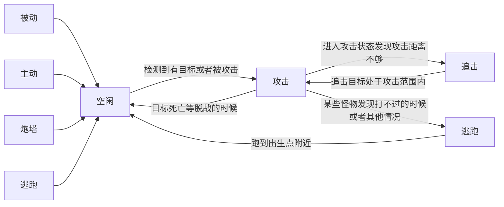

```erlang
monster新增字段
patrol_type : 巡逻类型 0 站立 1 自由 2 路径
patrol_radius = 10,
ai_init_type ：ai初始化类型： 0 无AI， 1 指定AI id， 2 完全随机 3 在分组类随机
ai_id  : ai id
ai_type ： ai类型 0无类型，1 被动 2 主动 3炮塔

ai配置定义
id
type ai类型
group 组
[buffid1, ...]
[{技能id,触发器,目标}, ...]

目标:
0 ：群体技能
1 ：自己
2 ：当前目标
3 ：仇恨列表最大


AI触发器配置定义：
id
event 事件
[参数1,...]
prop 概率
cond 条件
[参数1， ...]
eg.被攻击时 当血量低于 80% ，100%触发


```



