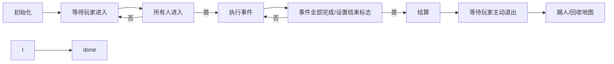
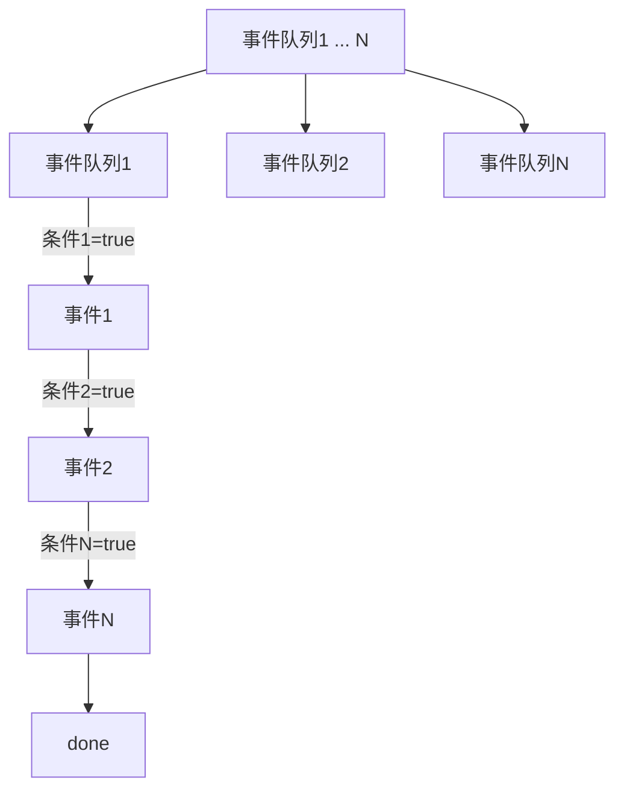

## 副本流程

```mermaid
graph LR
A[初始化]-->B[等待玩家进入]
B --> C[所有人进入]
C --> |是|D[执行事件]
C --> |否|B
D --> E[事件全部完成/设置结束标志]
E --> |否|D
E --> |是|F[结算]
F --> G[等待玩家主动退出] 
G --> H[踢人/回收地图]
I --> N[done]
```

## 副本并行事件队列

```mermaid
graph TD

A[事件队列1 ... N]
A --> E[事件队列1]
A --> F[事件队列2]
A --> X[事件队列N]

E --> |条件1=true|G[事件1]
G --> |条件2=true|H[事件2]
H --> |条件N=true|I[事件N]
I --> N[done]

```

